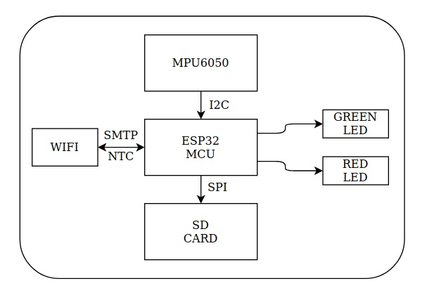
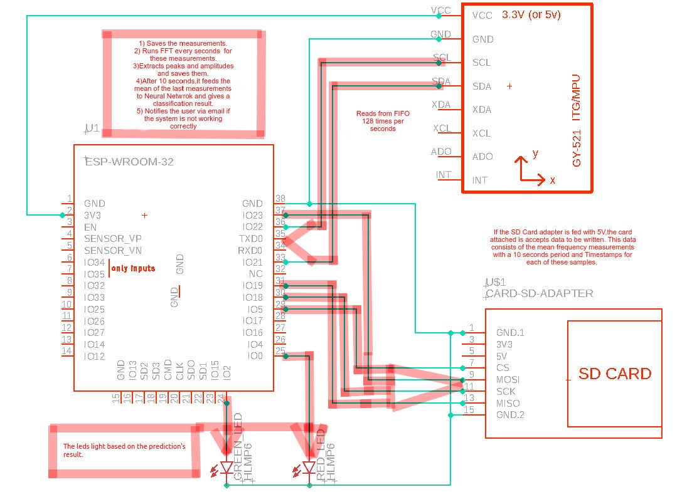
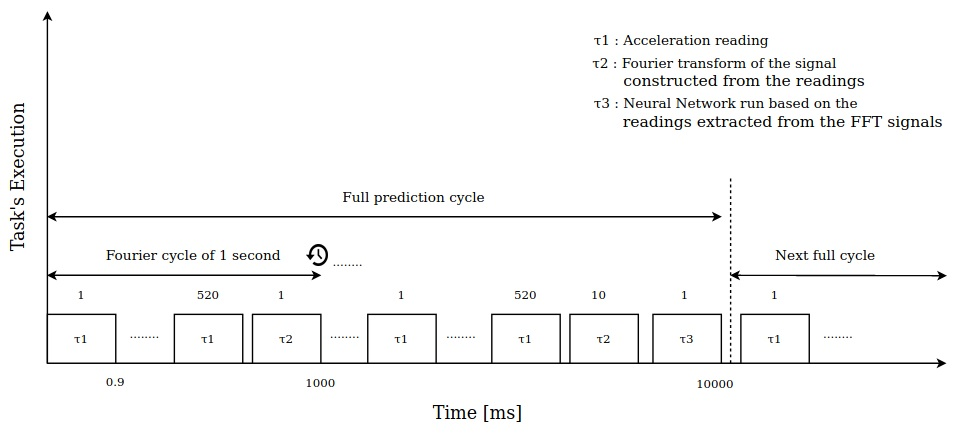
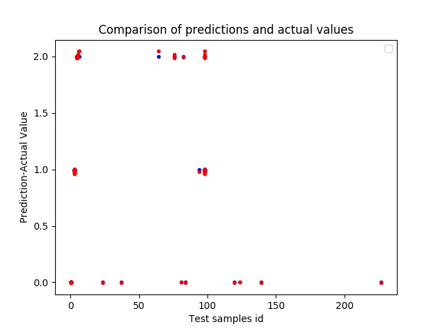

# Master_Thesis_Introduction
The aim of this thesis project is to implement a system for monitoring a centrifugal pump, in order to detect and warn of malfunctions of the
pump. Error detection is performed using digital signal processing, in conjunction with machine learning techniques that run on a microprocessor
in real-time.
Digital signal processing is applied to the vibration signals received by an accelerometer with a specific sampling frequency. Using proper signal processing, 
evaluation metrics are generated which evaluate the operation of the pump (incorrect, dangerousor, normal).
The values of the metrics produced by the analysis of a vibration signal, define a sample. Successive samples define the data
set used as input to an artificial neural network. This network determines the condition of the pump. Based on the output of the neural network,
one of the LEDs of the system is activated accordingly. In case of fault detection, a notification email mechanism has been implemented that informs
the user for his pump’s malfunction. To record and store the status data of the pump, a microSD memory card slot was integrated into the
system. In this way the data is available for further study and detection of complex pump operating errors. Finally, for the purpose of testing, creating and
collecting the neural network’s training data set, as well as the experimental use of the detector under discussion, Wilo STAR RS 25/4 residential
centrifugal pump was used to circulate water in a small radiator.

# System_Architecture

# Hardware_Design

# Software Architecture

# Task Scheduling

# Neural Network architecture

# Neural Network tested on real data

# Files
1) Τtime series analysis out of sensor readings and fourier transformations in python.
2) Neaural Network model production and extraction of it's weights to be used in the MCU.
3) Files which were used in order to flash the MCU.
